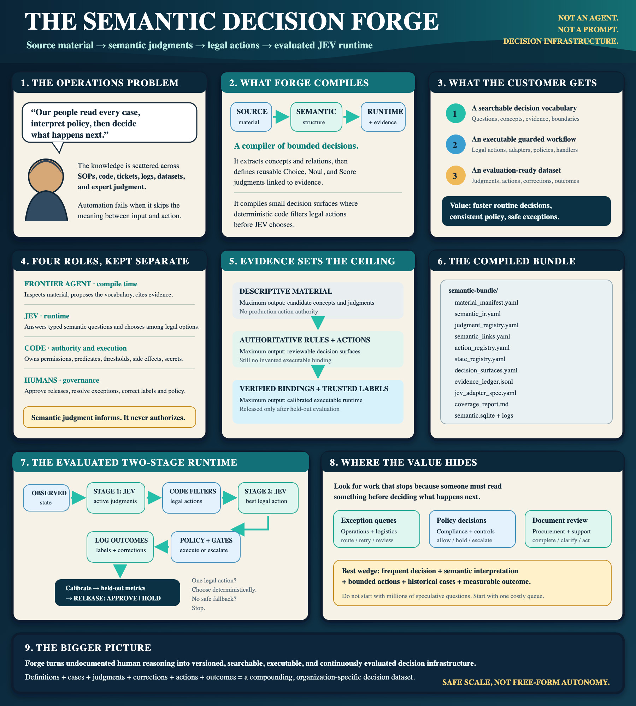

# action-vocabulary-forge

[](docs/executive-comic.pdf)

*One-page explainer ([PDF](docs/executive-comic.pdf)). The Forge does not inject the JEV into a
system; it compiles the system's decisions into a bundle and generates the adapter the system
calls at one decision point. Note: panel 6 uses illustrative binding field names; the real
schema is `binding: {kind: python_callable, locator: module:callable, ...}`, see
[references/bundle-schema.md](references/bundle-schema.md).*

Point it at a system, approve the release gate, use it. The Forge turns a
codebase, API, UI, SOP set, or trace log into an **Action Bundle**: a closed,
evidence-graded vocabulary of states, actions, transitions and decision
surfaces, plus a generated adapter that lets TypeSafe's JEV pick the next
action inside deterministic guard rails.

```text
system
  -> discovery (an agent following SKILL.md) writes the bundle with evidence
  -> validate_action_bundle.py refuses what is not proven
  -> generate_adapter.py renders the adapter: JEV call, policy, gates, handlers, log
  -> the adapter runs; every decision lands in decision_log.jsonl
  -> calibrate_thresholds.py turns labeled history into per-action thresholds
  -> evaluate_decisions.py prints the metrics and RELEASE GATE: APPROVE | HOLD
  -> a human grants credentials, answers the gate, resolves abstentions
```

JEV only ever answers a bounded question ("here is the state, here are the legal
actions and their criteria, choose one"). Code decides what is legal, applies
thresholds and abstention, re-checks preconditions, and executes through a
handler that was generated from an observed binding, never from a guess.

## Status

v0.3. One real system wired end to end (a question-routing surface in an internal
ag-commodity tool: 5 generated handlers, JEV 53/54 vs 33/54 for the keyword
resolver it replaced, release gate approved). `python_callable`, `http` and `cli`
handlers have run for real; `ui` (Playwright) and `mcp` (MCP SDK) renderers are
unit-tested at the SDK boundary but not yet exercised against a live browser or
server. Expect the bundle schema to move; the validator is the contract.

## Install as a skill

```bash
git clone https://github.com/FrancyJGLisboa/action-vocabulary-forge ~/projects/action-vocabulary-forge
~/projects/action-vocabulary-forge/scripts/install.sh      # symlinks into Claude, Codex, Copilot, Gemini
```

Requires Python 3.11+ and PyYAML. `ui` handlers need Playwright and `mcp` handlers the `mcp` package, only on the host that runs them. `TYPESAFE_API_KEY` is read from the
environment at call time and never written into a bundle.

## Layout

```text
SKILL.md                     the workflow an agent follows (discover -> validate -> generate -> calibrate -> evaluate)
references/bundle-schema.md  every bundle field, including binding, policy, criteria_source, predicates
references/adapter-generation.md   what the generated module contains and how a host uses it
references/evaluation.md     metrics, calibration rule, release gate
references/source-playbook.md   mixed-source discovery guidance
scripts/init_action_bundle.py       scaffold an empty or example bundle
scripts/scan_llm_opportunities.py   heuristic scan for classifier-replaceable generative calls
scripts/validate_action_bundle.py   structural and safety checks
scripts/compile_jev_surface.py      one surface, one state -> compiled choice set
scripts/generate_adapter.py         bundle -> Python adapter (embeds scripts/predicates.py)
scripts/calibrate_thresholds.py     decision log + labels -> policy thresholds
scripts/evaluate_decisions.py       held-out metrics + release gate
scripts/run_jev_choice.py           minimal manual JEV call for a compiled surface
examples/validation-bundle/         the reference bundle used by the tests
tests/                              unit tests per feature plus test_end_to_end.py
```

## Try it

```bash
cd ~/projects/action-vocabulary-forge
python3 -m unittest discover -s tests -v
python3 scripts/validate_action_bundle.py examples/validation-bundle
python3 scripts/generate_adapter.py examples/validation-bundle --output /tmp/forge/adapter.py
python3 -c "import sys; sys.path.insert(0,'tests'); from test_end_to_end import write_fixture; write_fixture('/tmp/forge')"
python3 scripts/calibrate_thresholds.py /tmp/forge/bundle --log /tmp/forge/decision_log.jsonl --labels /tmp/forge/labels.jsonl --write
python3 scripts/evaluate_decisions.py /tmp/forge/bundle --log /tmp/forge/decision_log.jsonl --labels /tmp/forge/labels.jsonl
```

## Editing

`examples/validation-bundle/` is generated from `scripts/init_action_bundle.py
--example`; edit the script and regenerate (`--force`). The pre-commit hook
runs the tests, validates the example, and refuses a drifted example. The
references are hand-written.
